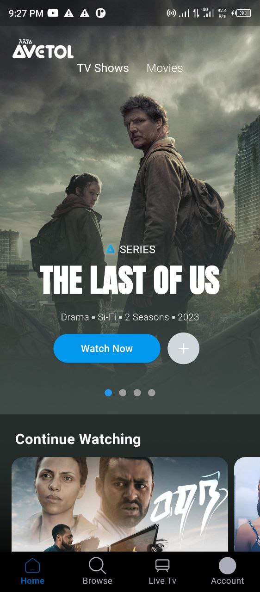
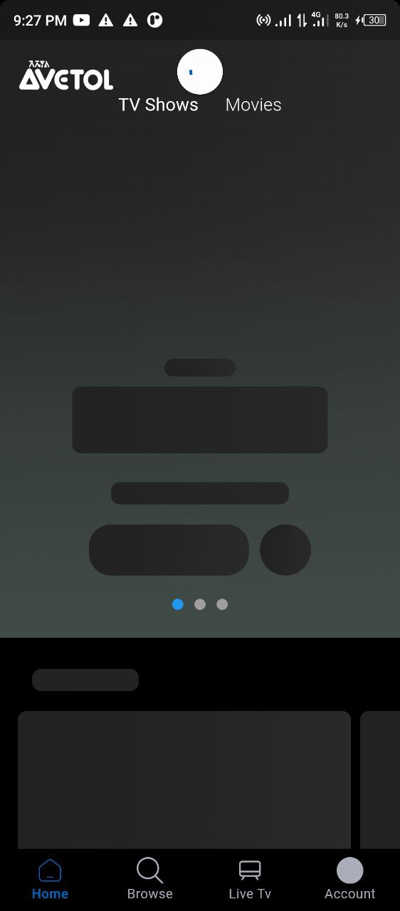
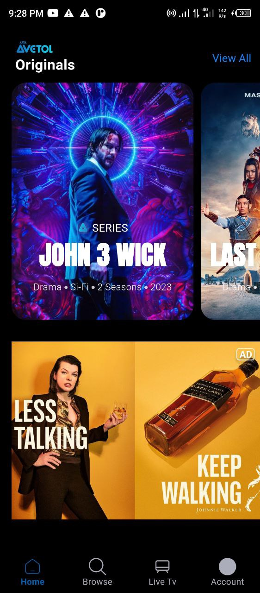

# Avetol Movie App 

Avetol is All your Entertainment in one place. It's an Ethiopian streaming app. This app contains the landing page of a conceptual UI design.

<div style="display: flex;">
  
  
  
</div>


## Folder Structure

I used clean architecture for implementation:

```
lib
    - core : for shared utils files <br>
    - features<br>
        - data : local data source and movie models, for generating dummy movie data<br>
        - presentation : normal UI pages and widgets<br>
```


## Used Libraries and Packages 

1. carousel_slider: ^4.2.1 - for smooth slider 
2. skeletons: ^0.0.3 - for widget placeholder 

